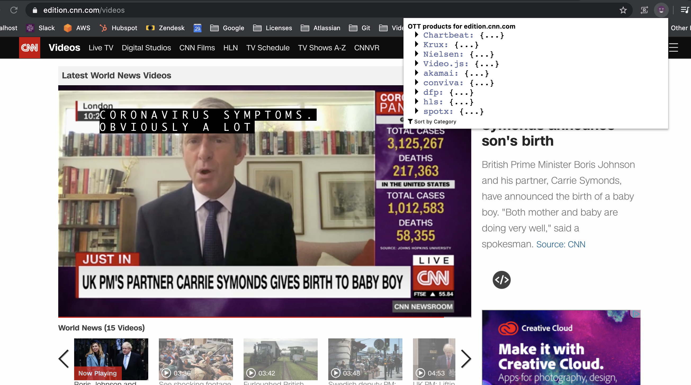

# Summary
TL;DR: product-watcher is like BuiltWith.com, but it's a Chrome extension which detects the leveraged products on a website.
The list of products (and patterns) is provided through a JSON file.

## Use-case
You work in the online video streaming industry, 
and you want to know which products and technologies are used on a specific video streaming website.

You create (or find) a products.json file which contains all the products and patterns you want product-watcher to monitor.
You feed your products.json file to product-watcher.

# Installation
1. Download this repository to your local file system. (Unzip it if you downloaded a .zip file.) Confirm that you have an `extension/` folder.
2. Open Chrome.
3. Go to chrome://extensions through your address bar.
4. Enable "Developer Mode".
5. Click "Load unpacked".
6. Navigate to the `extension/` folder of this repository.
7. Confirm that the extension is toggled on.

# Usage
1. Replace the default products.json with your own products.json file.
2. Go to a website where you want to product-watcher to run. Replicate a normal user-experience because product-watcher watches the network traffic.
3. Click the extension button. (It's a round purple smiley/ball.)
4. Check which products were detected!

# FAQ
How does it work?
- The extension compares all network request URLs with a set of patterns.

It doesn't work -- what do I do?
- Try to re-install it. E-mail lowette@gmail.com if that doesn't help.

What are the next feature improvements?
- Create a flatter structure instead of a nested structure of products.json.
- Build /extension/page_action/ files through webpack.
- Make the extension more generic and not specific to OTT.
Create a template for products.json, and use OTT as an example.
 
 Is there a video illustrating the installation and usage of product-watcher?
 * Yep! Check out [installation_and_usage_of_product-watcher.mp4](installation_and_usage_of_product-watcher.mp4).